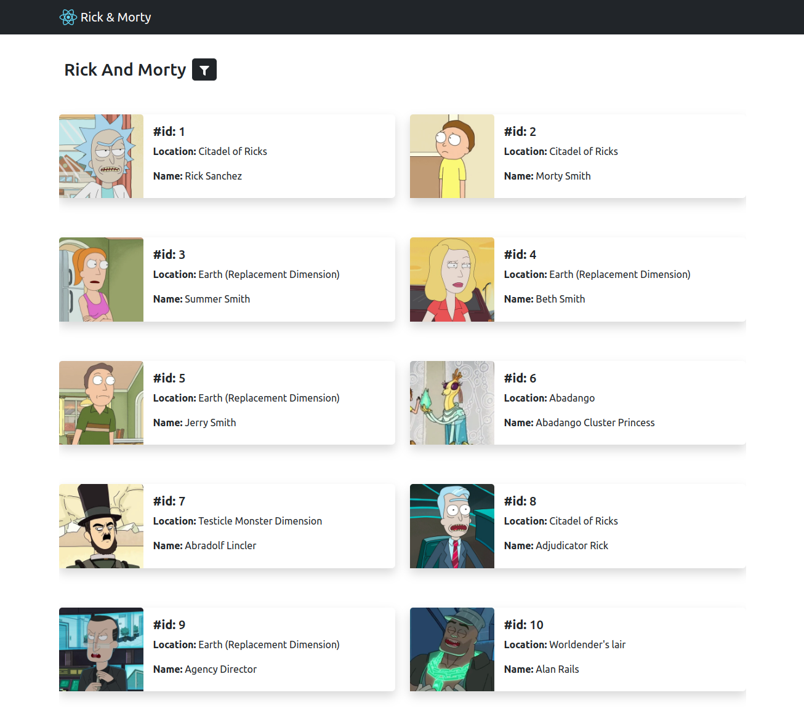

# Rick And Morty

React/TypeScript App that lists all "Rick and Morty" characters using GraphQL.

## Demo

https://rick-and-morty-typescript.netlify.app/

## Tech Stack

**API:** https://rickandmortyapi.com/graphql

- TypeScript
- Apollo/GraphQL
- React-BootStrap
- React-infinite-scroll
- React-icons
- Context API

## Ekran Görüntüleri

### Criteria

- [x] &nbsp;React Hooks
- [x] &nbsp;TypeScript
- [x] &nbsp;Apollo Graphql Client
- [x] &nbsp;Infinite Scroll
- [x] &nbsp;Figma Design
- [x] &nbsp;Filtering
- [ ] &nbsp;Unit & Integration Testing
- [x] &nbsp;Github Public Repo
